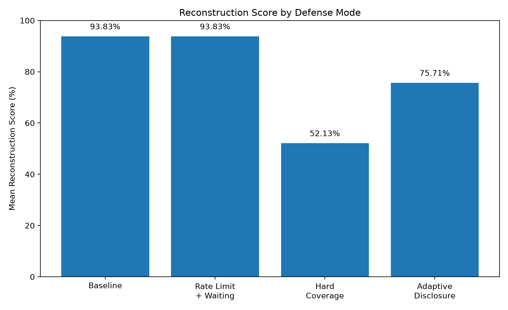
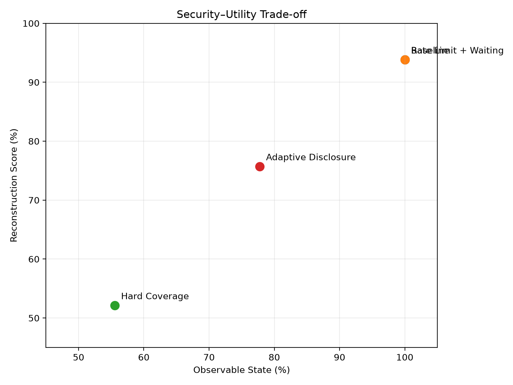

# Experimental Results — v0.1

**Project:** MCP Inference Security  
**Experiment:** 001  
**Runs:** 1000 randomized trials
**Random seed:** 405  
**Status:** Toy Proof-of-Concept

---

## 1. Research Question

This experiment asks:

> Can lightweight cumulative exposure controls reduce reconstruction of hidden state more effectively than conventional time-based rate limiting?

The experiment compares four modes:

1. Baseline
2. Rate Limiting with Waiting
3. Hard Coverage Policy
4. Adaptive Disclosure

---

## 2. Experimental Environment

The experiment uses a synthetic hidden state containing:

- 3 locations;
- 3 resource types;
- 9 total location/resource combinations.

The hidden state is not directly available to the observer.

Different tools expose partial information derived from the same underlying state.

The observer attempts to reconstruct that state using only permitted responses.

Query order is randomized across 1000 runs to reduce ordering bias.

---

## 3. Results

| Mode | Mean Reconstruction Score | Observable State |
|---|---:|---:|
| Baseline | 93.83% | 100.00% |
| Rate Limit + Waiting | 93.83% | 100.00% |
| Hard Coverage Policy | 52.13% | 55.56% |
| Adaptive Disclosure | 75.71% | 77.78% |

Additional ranges:

| Mode | Minimum Score | Maximum Score |
|---|---:|---:|
| Baseline | 93.83% | 93.83% |
| Rate Limit + Waiting | 93.83% | 93.83% |
| Hard Coverage Policy | 50.78% | 53.39% |
| Adaptive Disclosure | 73.83% | 77.44% |

Raw results are stored in:

`benchmark-v0.1.json`

---

## Figures

### Figure 1 — Reconstruction Score by Defense Mode

This figure compares the mean reconstruction score across the four experimental modes.

Baseline and Rate Limit + Waiting produce the same final reconstruction score in this toy experiment.

Hard Coverage reduces reconstruction most strongly, while Adaptive Disclosure produces an intermediate result.

---

### Figure 2 — Security–Utility Trade-off

This figure compares observable state against reconstruction score.

Baseline and Rate Limit + Waiting overlap because both eventually expose the same final state under the assumptions of this experiment.

Hard Coverage reduces both observability and reconstruction.

Adaptive Disclosure occupies an intermediate position, preserving more observable state while reducing reconstruction relative to baseline.

---

## 4. Baseline

The baseline observer received all permitted responses without cumulative exposure controls.

Mean reconstruction score:

**93.83%**

Observable state:

**100%**

This establishes the reference point for the experiment.

---

## 5. Rate Limiting

The rate-limited observer was temporarily prevented from issuing additional requests after reaching the configured request threshold.

However, the observer was allowed to wait for the rate-limit window to reset and continue querying.

Final result:

**93.83% reconstruction score**

**100% observable state**

In this toy environment, conventional time-based rate limiting changed the time required to collect information but did not change the final informational outcome.

This does not imply that rate limiting is ineffective as a security mechanism generally.

It only indicates that rate limiting alone did not reduce eventual cumulative disclosure under the assumptions of this experiment.

---

## 6. Hard Coverage Policy

The hard coverage policy tracked unique location/resource combinations rather than request frequency.

After five unique combinations had been exposed, additional previously unseen combinations were denied.

Result:

**52.13% mean reconstruction score**

**55.56% observable state**

Unlike time-based rate limiting, waiting did not reset the exposure budget.

The mechanism therefore reduced the final portion of the hidden state available to the observer.

However, this protection came at a substantial utility cost because legitimate access to additional combinations was also prevented.

---

## 7. Adaptive Disclosure

Adaptive disclosure progressively reduced response precision as structural coverage increased.

The experimental policy used the following progression:

- early queries: exact values;
- intermediate queries: numeric ranges;
- later queries: categorical values;
- highest exposure level: limited response.

Result:

**75.71% mean reconstruction score**

**77.78% observable state**

This produced an intermediate result between unrestricted disclosure and hard blocking.

The observer retained access to more useful information than under the hard coverage policy, while reconstruction remained lower than the baseline.

---

## 8. Preliminary Interpretation

The experiment demonstrates a simple distinction between two types of control.

### Request-frequency control

Rate limiting controls:

> How quickly can the client ask?

### Exposure-aware control

Coverage accounting controls:

> How much distinct state has the client already observed?

Under the assumptions of this toy environment, these questions produce different security outcomes.

The rate limit delayed collection but eventually allowed the same observable state as the baseline.

Coverage-aware mechanisms changed the final amount or precision of information available to the observer.

---

## 9. Security–Utility Trade-off

The results also expose a trade-off.

Hard coverage produced the lowest reconstruction score:

**52.13%**

but exposed only:

**55.56%**

of the state.

Adaptive disclosure exposed:

**77.78%**

while producing a reconstruction score of:

**75.71%**

This suggests that future work should not optimize only for minimum information disclosure.

A practical mechanism would need to optimize both:

- resistance to cumulative reconstruction;
- legitimate client utility.

---

## 10. Metric Definition

The current reconstruction score is an experimental metric created for this toy environment.

Each hidden-state cell receives a normalized score between 0 and 1.

For estimable cells:

`score = 1 - (absolute_error / 100)`

Unknown or unavailable cells receive:

`score = 0`

The final reconstruction score is the mean across all cells.

This metric allows all experimental modes to be compared using the same scale.

It should not be interpreted as a standardized information-theoretic privacy metric.

---

## 11. Limitations

This experiment has substantial limitations.

### Small synthetic state

The hidden state contains only nine combinations.

Real systems may contain thousands or millions of dimensions.

### Synthetic tools

The current tools are simplified simulations rather than production MCP servers.

### Simplified observer

The observer uses deterministic reconstruction rules rather than statistical inference, machine learning, or an LLM agent.

### Simplified identity model

The experiment does not currently model:

- multiple identities;
- Sybil attacks;
- colluding clients;
- cross-server identities;
- identity rotation.

### Simplified temporal model

The hidden state is static.

Real operational data changes over time.

### Experimental metric

The reconstruction score is project-specific and has not been validated against established privacy or information-theoretic metrics.

### No production performance evaluation

The experiment does not yet measure realistic:

- gateway latency;
- memory overhead;
- distributed state synchronization;
- cache behavior;
- throughput.

---

## 12. What This Experiment Does Not Prove

This experiment does **not** prove:

- that MCP is insecure;
- that a new vulnerability class has been discovered;
- that coverage accounting should become part of the MCP specification;
- that adaptive disclosure is superior to established privacy mechanisms;
- that these results generalize to production systems.

The experiment provides evidence only for a narrower claim:

> In this synthetic environment, cumulative structural exposure controls changed the final reconstruction outcome, while conventional time-based rate limiting primarily changed collection time.

---

## 13. What the Experiment Supports

The results justify further investigation of:

- cumulative exposure accounting;
- cross-tool information composition;
- adaptive disclosure policies;
- security–utility optimization;
- lightweight gateway enforcement.

The next experimental stage should test whether the observed effect persists under larger and more realistic conditions.

---

## 14. Next Phase

Version 0.2 should expand the experiment rather than immediately propose a protocol change.

Potential additions include:

1. larger randomized hidden states;
2. multiple tool schemas;
3. changing state over time;
4. multiple observers;
5. identity rotation;
6. cross-server composition;
7. stronger reconstruction algorithms;
8. latency and state-overhead measurement;
9. comparison with established privacy mechanisms;
10. formal utility metrics.

Only after these tests should the project evaluate whether an MCP-specific architectural mechanism is justified.

---

## Conclusion

The first experiment produced a measurable difference between request-frequency controls and cumulative exposure-aware controls.

That result is promising enough to justify further experimentation.

It is not yet evidence for a new standard.

The next objective is therefore not to make the claim larger.

It is to make the experiment harder to pass.
